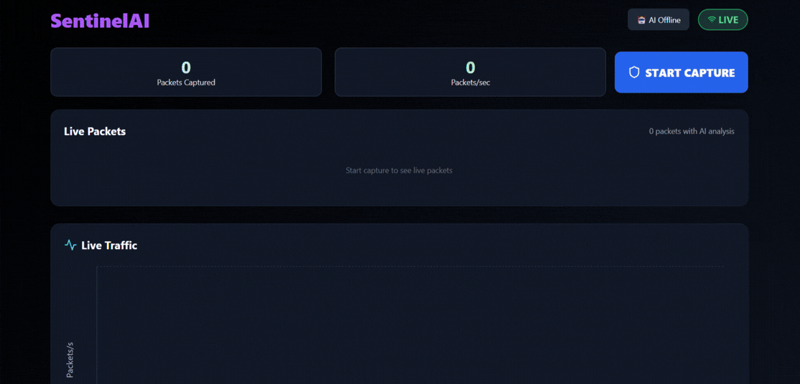

# 🌐 SENTINEL AI

**AI-Driven DDoS Detection & Mitigation for 5G Networks using Machine Learning + SDN + Real-Time Analytics**



---

## 📌 Project Overview

**Sentinel AI** is an enterprise-grade, AI-powered **5G DDoS Detection & Mitigation System** integrating:

- **Machine Learning (Python + Flask)** - Ensemble models with XAI explanations
- **Software-Defined Networking (SDN) via Ryu Controller** - Dynamic flow control
- **Mininet network emulation** - Network topology simulation
- **React real-time monitoring dashboard** - Live traffic visualization
- **Node.js backend orchestration** - API server with WebSocket support
- **Locust traffic & DDoS load testing** - Performance testing suite

The system delivers **real-time attack detection**, **5G network slicing support**, and **autonomous mitigation** using OpenFlow rules, with comprehensive testing and monitoring capabilities.

---

## ⭐ Key Capabilities

### 🔥 AI-Powered Detection
- **Ensemble ML Models**: RandomForest, XGBoost, LSTM, Autoencoder
- **Sub-50ms Inference**: Real-time packet classification
- **17 Feature Extraction**: Flow statistics, protocol analysis, temporal patterns
- **Explainable AI (XAI)**: 
  - Top 5 contributing features with impact scores
  - Risk factor identification based on feature analysis
  - Natural language decision explanations
  - Confidence-based threat assessment
- **Online Learning**: Continuous model adaptation
- **Fallback Detection**: Rule-based detection when ML unavailable

### 📶 5G Network Slice Intelligence
- **eMBB Classification**: High-bandwidth traffic analysis
- **URLLC Detection**: Ultra-low latency attack identification
- **mMTC Monitoring**: Massive IoT device protection
- **Slice Isolation**: Network segmentation security

### 🧠 Self-Healing SDN Architecture
- **Automatic IP Blocking**: OpenFlow DROP rules via Ryu controller
- **Dynamic Flow Management**: Priority-based rule insertion
- **Auto-Recovery**: Intelligent unblocking after threat resolution
- **Fallback Mechanisms**: Rule-based detection when ML unavailable
- **Flow Cleanup**: Automatic expired rule removal

### 🔐 Advanced SDN Controller (Ryu)
- **REST API Integration**: `ryu.app.ofctl_rest` communication
- **OpenFlow 1.3 Support**: Modern protocol compatibility
- **Mininet Integration**: Network topology simulation
- **Real-time Rule Updates**: Dynamic flow table management
- **IP Quarantine System**: Configurable blocking timeouts

### 📊 Comprehensive Dashboard
- **Live Packet Monitoring**: Real-time traffic visualization with time-formatted charts
- **AI Explanation Panel**: Interactive model prediction insights with:
  - Verdict display (DDOS/NORMAL) with confidence bars
  - Top 5 contributing features with impact visualization
  - Risk factors with detailed descriptions
  - Model insights and analysis metadata
- **Multi-Chart Analytics**: Normal/malicious/simulated traffic with gradient fills
- **5G Slice Performance**: Network segmentation metrics with color coding
- **Threat Management**: Blocked IP tracking with AI explanation buttons
- **Interactive UI**: Click any packet or blocked IP to view detailed AI analysis

---

## 🏗 System Architecture

```
┌─────────────────┐      ┌───────────────────┐      ┌─────────────────┐
│   Traffic       │ ---> │  Packet Capture    │ ---> │  Feature         │
│ (Real/Simulated)│      │ (Scapy / Pyshark) │      │ Extraction       │
│   via Locust    │      │  + Mininet        │      │ (17 features)   │
└─────────────────┘      └───────────────────┘      └─────────────────┘
                              │
                              ▼
┌─────────────────┐      ┌───────────────────┐      ┌─────────────────┐
│ Network Slicing │ <--- │   ML Engine        │ ---> │  Backend API     │
│ eMBB/URLLC/mMTC │      │ Ensemble Models    │      │ Node.js + WS     │
│ Classification  │      │ + XAI Explanations│      │ (Port 3000)      │
└─────────────────┘      └───────────────────┘      └─────────────────┘
                              │
                              ▼
┌─────────────────┐      ┌───────────────────┐      ┌─────────────────┐
│ Ryu SDN         │ <--- │  Mitigation Logic │ ---> │  React Dashboard │
│ Controller      │      │ Auto-block IPs    │      │ Real-time UI     │
│ (Port 6633)     │      │ + Flow Rules      │      │ (Port 5173)      │
└─────────────────┘      └───────────────────┘      └─────────────────┘
```

---

## ⚙️ Installation Guide

### 1️⃣ Install WSL & Ubuntu
```bash
wsl --install
wsl --install -d Ubuntu-20.04
```

### 2️⃣ Install Mininet
```bash
sudo apt update
sudo apt upgrade
sudo apt install mininet -y
sudo mn --test pingall
```

### 3️⃣ Install Python, Pip, Ryu
```bash
sudo apt install -y python3-pip
pip3 install --upgrade pip setuptools wheel
pip3 install eventlet==0.33.3
pip3 install ryu
```

### 4️⃣ Create Ryu Virtual Environment
```bash
python3.8 -m venv ryu-venv
source ryu-venv/bin/activate
ryu-manager --version
```

---

## 🖥️ Running the Entire System

### **Terminal 1 — Ryu SDN Controller**
```bash
source ryu-venv/bin/activate
ryu-manager ryu.app.simple_switch_13 ryu.app.ofctl_rest
```

### **Terminal 2 — Mininet Topology**
```bash
sudo mn --topo single,3 --mac --switch ovsk --controller=remote,ip=127.0.0.1,port=6633
```

### **Terminal 3 — Backend**
```bash
cd backend
npm install
npm start
```

### **Terminal 4 — Frontend**
```bash
cd frontend
npm install
npm run dev
```

### **Terminal 5 — ML Model (Flask)**
```bash
cd model
pip install -r requirements.txt
cd app
python app.py
```

---

## 🚦 Load Testing with Locust

### Install Locust:
```bash
cd DDOS
pip install locust
```

### Run Locust:
```bash
locust -f locustfile.py
```

### Access Load Test UI:
```
http://localhost:8089
```

---

## 🧠 Machine Learning Models Included

| Model               | Purpose                     |
| ------------------- | --------------------------- |
| Random Forest       | Primary classifier          |
| XGBoost             | Gradient boosted accuracy   |
| LightGBM            | Fast, memory-efficient      |
| LSTM                | Temporal behavior detection |
| SVM                 | Boundary-based detection    |
| Logistic Regression | Baseline                    |
| KNN                 | Similarity detection        |

---

## 🔐 SDN Flow Control (Ryu)

The SDN controller manages network traffic through dynamic flow rules:

- **DROP rules** for blocking malicious IPs via OpenFlow
- **FORWARD rules** for allowing legitimate traffic
- **Flow table management** with priority-based rule insertion
- **Automatic cleanup** of expired flow rules
- **IP quarantine system** with configurable timeout

**Integration Points:**
- Ryu Controller REST API (`ryu.app.ofctl_rest`)
- OpenFlow 1.3 protocol support
- Mininet topology integration
- Real-time flow rule updates from ML engine

---

## 🔄 Self-Healing Pipeline

```
Packet Received → Feature Extraction (17 features)
     ↓
ML Ensemble Prediction (RandomForest + XGBoost + LSTM)
     ↓
Confidence Threshold Check (>80% = Attack)
     ↓
DDoS Detected → SDN Controller API Call
     ↓
OpenFlow DROP Rule Applied (IP Blocked)
     ↓
Traffic Monitoring for Recovery Patterns
     ↓
Auto-Unblock IP (Flow Rule Removed)
     ↓
System Returns to Normal State
     ↓
Online Learning Updates Model Weights
```

---

## 📊 Dashboard Features

**Real-Time Monitoring:**
- Live packet capture and analysis with clickable packet inspection
- Real-time traffic charts with formatted time axis (HH:MM:SS)
- Packet-per-second metrics and statistics
- Network slice performance monitoring
- Interactive packet table with AI analysis indicators

**AI-Powered Insights:**
- ML model confidence scores with visual progress bars
- Explainable AI (XAI) predictions with detailed breakdowns
- Top 5 contributing features with impact visualization
- Risk factor identification and categorization
- Decision basis explanations in natural language
- Feature importance with z-score values

**Network Security:**
- Blocked IP management with auto-unblock functionality
- Threat level classification (high/medium/low/simulated)
- IP quarantine status tracking with confidence percentages
- Mitigation action history with timestamps
- AI explanation panel for each blocked IP
- One-click threat investigation

**5G Network Slicing:**
- eMBB, URLLC, mMTC slice classification
- Slice-specific traffic analysis and visualization
- Network performance metrics per slice
- Slice isolation monitoring and alerts
- Color-coded slice indicators

**System Health:**
- Backend/ML service connectivity status (real-time)
- Model performance metrics (17 features tracked)
- Feature count display in header
- System resource monitoring
- Alert and notification system
- WebSocket connection status indicator

---

## 🛠 Future Enhancements

- Docker & Kubernetes deployment
- Federated learning for edge devices
- 5G NR physical-layer packet support
- GPU-accelerated inference

---

## 🔧 Troubleshooting

### Common Issues

**Issue: AI Explanation shows "No significant risk factors detected"**
- **Cause**: Scaled feature values don't meet threshold or prediction is "normal"
- **Solution**: System now generates risk factors from top contributing features automatically
- **Expected**: 1-3 risk factors for DDoS predictions with confidence > 0.7

**Issue: Confidence shows 0.0%**
- **Cause**: Confidence value is undefined, null, or not properly typed
- **Solution**: System uses nullish coalescing (??) and type checking
- **Expected**: Confidence between 0.1% - 99.9% for all predictions

**Issue: Verdict shows "UNKNOWN"**
- **Cause**: ML detection returned error or models failed to load
- **Solution**: System validates predictions and uses confidence-based fallback
- **Expected**: Always shows "DDOS" or "NORMAL", never "UNKNOWN"

**Issue: Feature count shows 0**
- **Cause**: Flask health endpoint was checking local scope instead of global
- **Solution**: Fixed to check global `feature_names` variable
- **Expected**: Shows "17 features" in header when ML engine is ready

**Issue: X-axis shows numbers like 1771773120**
- **Cause**: Unix timestamp displayed without formatting
- **Solution**: Added `formatTime` function with `tickFormatter`
- **Expected**: Shows time as "10:45:30 AM" format

### Debug Mode

Enable console logging to debug issues:
1. Open browser DevTools (F12)
2. Check Console tab for:
   - `AIExplanation received:` - Shows explanation data
   - `Model status received:` - Shows feature count
   - `Packet selected:` - Shows packet data
3. Check Flask logs for:
   - `✅ MODELS LOADED SUCCESSFULLY`
   - `Explanation generated: confidence=X, prediction=Y`
   - `Health check: features_count=17`

---

## 📜 License

This project is for academic and research use.
Refer to the LICENSE file for details.

---

## 🎯 Conclusion

**Sentinel AI** provides a complete, autonomous, real-time DDoS defense system for modern 5G networks, utilizing:

- AI
- SDN
- Network slicing
- Real-time analytics
- Self-healing mechanisms

Perfect for research, enterprise labs, and advanced cybersecurity projects.
